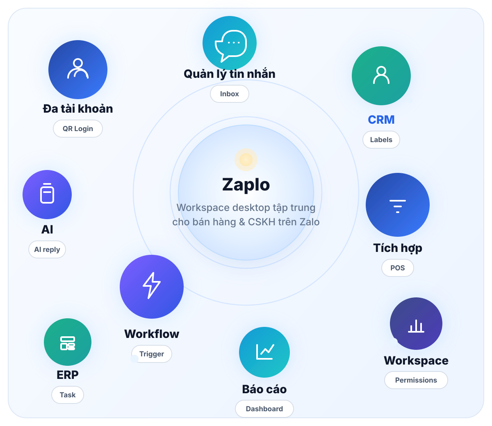
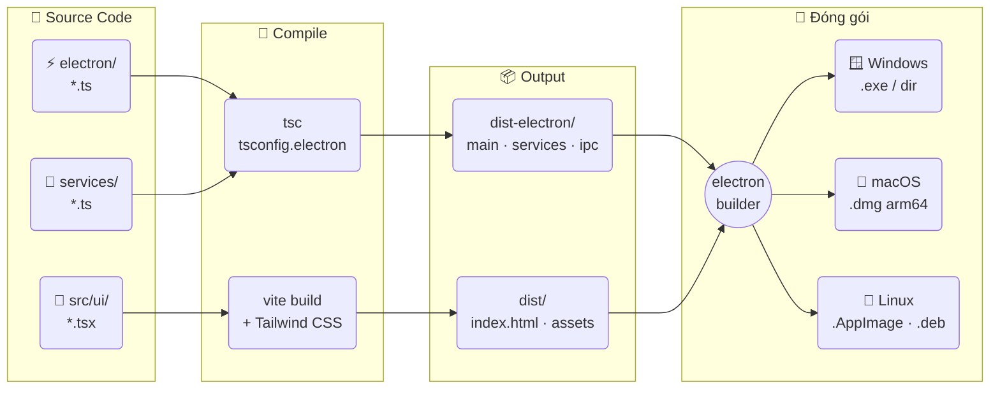
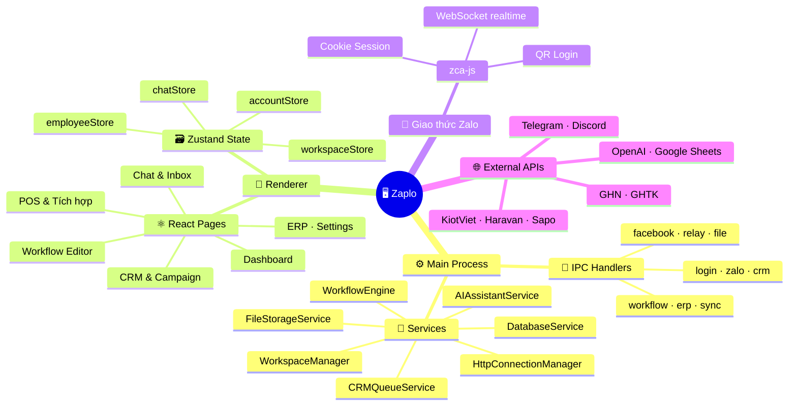
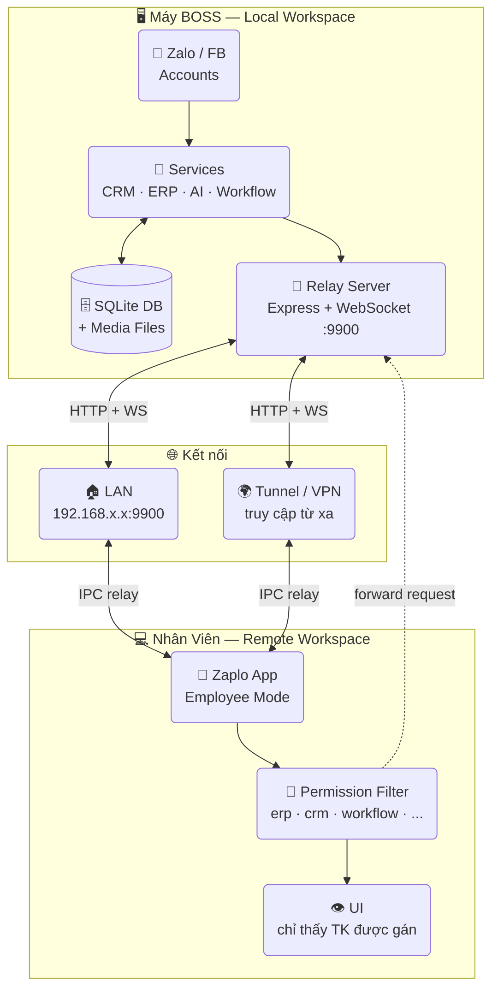
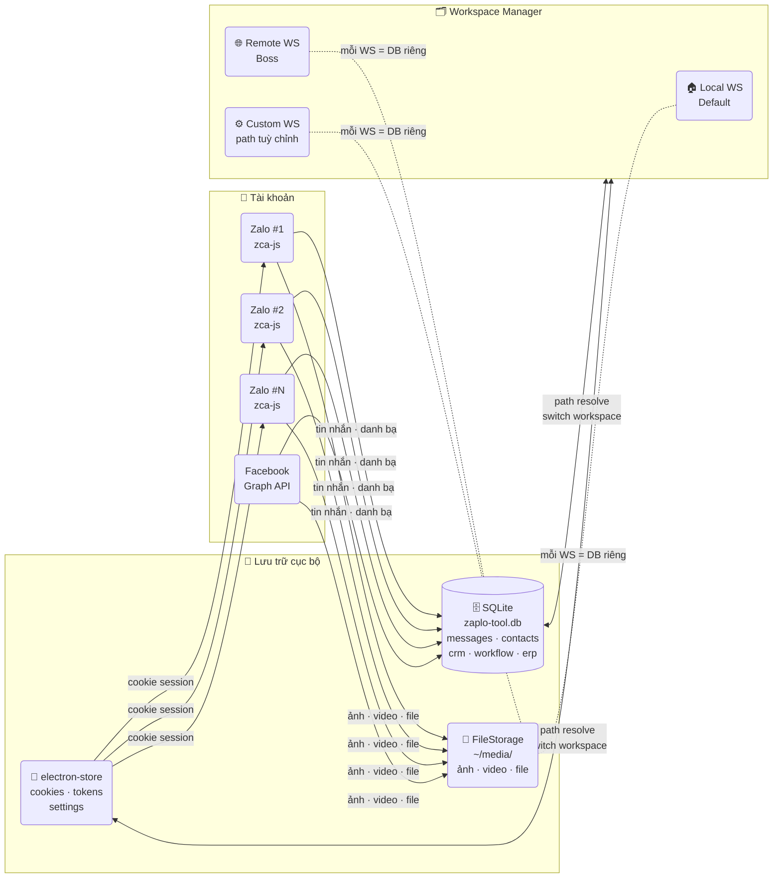

# Zaplo — Trung tâm vận hành Zalo & Facebook cho đội nhóm

*Website giới thiệu*: https://deplaoapp.com/

<p>
  <strong>🌐 Language:</strong>
  &nbsp;🇻🇳 <strong>Tiếng Việt</strong>
  &nbsp;|&nbsp;
  🇬🇧 <a href="./README.en.md">English</a>
</p>

---

> **Zaplo** là desktop app Electron + React + TypeScript giúp đội nhóm bán hàng, marketing, chăm sóc khách hàng quản lý nhiều tài khoản Zalo & Facebook trong một giao diện duy nhất. Tích hợp CRM, AI & Agent hub tự động, Kho bài & rải lịch, Auto-comment, Workflow kéo-thả, ERP nội bộ, và không giữ dữ liệu trên cloud — mọi thứ lưu cục bộ máy bạn.

[](#)
[](#-yêu-cầu-hệ-thống)
[](#)
[](#)
[](#)
[](#)
[](#)
[](#)
[](#giấy-phép)
[](https://github.com/andyluu98/zaplo/issues)


<p align="center">
  <a href="#-tải-xuống">📥 Tải xuống</a> &nbsp;|&nbsp;
  <a href="#-yêu-cầu-hệ-thống">⚙️ Yêu cầu</a> &nbsp;|&nbsp;
  <a href="#-cài-đặt--chạy-phát-triển">📦 Cài đặt</a> &nbsp;|&nbsp;
  <a href="#-tính-năng-chính">✨ Tính năng</a> &nbsp;|&nbsp;
  <a href="#-hướng-dẫn-nhanh">🚀 Hướng dẫn</a> &nbsp;|&nbsp;
  <a href="#-bảo-mật--dữ-liệu">🔒 Bảo mật</a> &nbsp;|&nbsp;
  <a href="#-giấy-phép">📝 MIT</a>
</p>

---

## ⬇️ Tải xuống (v26.7.38)

<table>
<tr>
<td align="center" width="50%">

<a href="https://github.com/andyluu98/zaplo/releases/latest/download/Zaplo-Setup-26.7.38.exe">

</a>

<big><strong>Zaplo-Setup-26.7.38.exe</strong></big>

</td>
<td align="center" width="50%">

<a href="https://github.com/andyluu98/zaplo/releases/latest/download/Zaplo-26.7.38-arm64.dmg">

</a>

<big><strong>Zaplo-26.7.38-arm64.dmg</strong></big>

</td>
</tr>
<tr>
<td align="center" width="50%">

<a href="https://github.com/andyluu98/zaplo/releases/latest/download/Zaplo-26.7.38.AppImage">

</a>

<big><strong>Zaplo-26.7.38.AppImage</strong></big><br>
<big>chạy mọi distro — <code>chmod +x</code> là dùng được</big>

</td>
<td align="center" width="50%">

<a href="https://github.com/andyluu98/zaplo/releases/latest/download/Zaplo-26.7.38.dmg">

</a>

<big><strong>Zaplo-26.7.38.dmg</strong></big>

</td>
</tr>
</table>

<p align="center">
👉 <strong><a href="https://github.com/andyluu98/zaplo/releases">Xem tất cả phiên bản</a></strong>
</p>

<details>
<summary>⚠️ Lưu ý khi mở file cài đặt (bị chặn bởi Windows / macOS / Linux)</summary>

Do Zaplo chưa được ký chứng chỉ (code signing) - nói thẳng ra là nghèo, nên hệ điều hành có thể hiển thị cảnh báo khi mở file. Bạn có thể làm theo hướng dẫn dưới đây:

---

### 🪟 Windows (.exe)

Khi mở file `.exe`, Windows có thể hiển thị cảnh báo **"Windows protected your PC"**:

👉 Cách xử lý:
1. Nhấn **More info**
2. Chọn **Run anyway**

---

### 🍎 macOS (.dmg)

Khi mở file `.dmg`, macOS có thể báo **"cannot be opened because it is from an unidentified developer"**

👉 Cách xử lý:

**Cách 1:**
- Chuột phải vào file → chọn **Open**
- Nhấn **Open** lần nữa

**Cách 2 (nếu vẫn bị chặn):**
1. Vào **System Settings → Privacy & Security**
2. Kéo xuống phần Security
3. Nhấn **Open Anyway**

---

### 🐧 Ubuntu Linux (.AppImage)

Sau khi tải file `.AppImage`:

```bash
chmod +x Zaplo-*.AppImage
./Zaplo-*.AppImage
```

> Nếu gặp lỗi "FUSE: fuse2 not available", cài `libfuse2`:
> ```bash
> sudo apt install libfuse2
> ```

Hoặc cài bản `.deb`:
```bash
sudo dpkg -i Zaplo_*_amd64.deb
```

</details>

<p align="center">
  
</p>

## ⚙️ Yêu cầu hệ thống

| Tiêu chí | Yêu cầu |
|---------|---------|
| **Hệ điều hành** | Windows 10/11, macOS 10.13+, Ubuntu 20.04+ |
| **Node.js** | 20+ (khuyến nghị 22+) |
| **npm** | 9+ |
| **RAM** | 2GB tối thiểu, 4GB khuyến nghị |
| **Kết nối** | Internet 24/7 để đồng bộ chat & automation |

---

## 🔧 Cài đặt & chạy phát triển

### 1. Cài đặt dependencies

```bash
npm install --legacy-peer-deps
```

### 2. Chạy development (hot-reload)

```bash
npm run dev
```

Lệnh này sẽ:
- Chạy Vite dev server (cổng 27799)
- Build & watch TypeScript cho Electron
- Khởi động Electron app (tự refresh khi code thay đổi)

### 3. Build production (đóng gói .exe/.dmg/.AppImage)

```bash
npm run production
```

Lệnh này sẽ:
1. Build E2EE bridge (nếu có)
2. Compile TypeScript tối ưu cho production
3. Build Vite renderer (gzip, tree-shake, obfuscate)
4. Đóng gói qua electron-builder
5. Output: `dist-electron-build/` chứa các file `.exe` (Windows), `.dmg` (macOS), `.AppImage` / `.deb` (Linux)

### 4. Các lệnh khác

```bash
# Chỉ build Electron (TypeScript)
npm run build:electron

# Chỉ build Renderer (HTML + CSS + JS)
npm run build:renderer

# Patch icon (chỉnh sửa icon cho Electron)
npm run patch-icon

# Build E2EE bridge (tùy chọn)
npm run build:bridge-e2ee
```

### 5. Dữ liệu & cấu hình cục bộ

- **Database:** SQLite file `zaplo-tool.db` (lưu trên máy, có thể đổi đường dẫn trong Settings)
- **Media:** Folder `~/media/` chứa ảnh, video, file tải xuống
- **Cookies & Settings:** Lưu qua electron-store (không lộ trên cloud)

## 🗺️ Sơ đồ kiến trúc & luồng hoạt động

---

### 1️⃣ Luồng Build



---

### 2️⃣ Kiến trúc Runtime



---

### 3️⃣ Mô hình Boss ↔ Nhân viên



> Nhân viên vẫn có **workspace riêng** (DB, media) trên máy. Do Zalo chỉ cho phép 1 kết nối cùng lúc, mọi request Zalo được **relay về Boss** để xử lý theo quyền đã cấp.

---

### 4️⃣ Đa tài khoản & Lưu trữ



> Mỗi **Workspace** có DB + media folder độc lập — đổi hoặc di chuyển sang ổ đĩa khác không mất dữ liệu.

---


## 🎯 Zaplo là gì?

Desktop app quản lý **Zalo + Facebook** cho đội nhóm bán hàng & marketing. Tất cả chức năng chạy cục bộ, không đẩy dữ liệu lên cloud.

**5 tầng chức năng:**
1. **Trung tâm Zalo** — nhiều tài khoản, inbox gộp, chat nhanh
2. **Trung tâm Facebook** — đăng bài, auto-comment, quản lý nhóm
3. **Trợ lý AI & Agent Hub** — AI gợi ý, Agent đăng bài đa kênh, Agent chat tự động
4. **CRM + Kho bài & Lịch nội dung** — quản lý liên hệ, lưu bài viết, rải lịch & lô bài
5. **Tự động hoá & ERP** — workflow kéo-thả, phân quyền nhân viên, báo cáo

---

## ✨ Tính năng chính

### 💙 Zalo — Quản lý & Chat
- **Đa tài khoản** — đăng nhập không giới hạn, chuyển đổi nhanh
- **Inbox gộp** — chế độ gộp nhiều tài khoản vào 1 hộp thư duy nhất
- **Chat đầy đủ** — văn bản, ảnh, video, file, emoji, sticker, reply, tag thành viên
- **Mẫu tin (Quick messages)** — lưu mẫu, gọi nhanh bằng từ khóa
- **Poll & Ghi chú nhóm** — tạo bình chọn, ghi chú chung trong group
- **Quét thành viên & khách mới** — quét thành viên nhóm, nhóm chưa tham gia

### 📘 Facebook — Đăng bài & Tương tác
- **Soạn & Đăng bài** — đăng lên tường hoặc nhiều nhóm cùng lúc
- **Nhập nhóm từ CSV** — quản lý nhiều nhóm, tải danh sách từ file
- **Auto-Comment** — tự động bình luận theo lịch trên các bài
- **Lịch nội dung** — xem & quản lý lịch đăng trên cả Zalo & Facebook
- **Kho bài chung** — lưu bài viết dùng chung 2 kênh (Zalo + Facebook)

### 🤖 AI & Agent Hub (Trợ lý & Tự động hoá)
- **🧠 Trợ lý AI (AI Assistant)**
  - Gợi ý trả lời thông minh trong chat Zalo & Facebook
  - Hỏi đáp trực tiếp với AI ngay trong khung chat
  - Hỗ trợ OpenAI, Claude, Gemini, 9router (AI gateway local)

- **✒️ Agent đăng bài đa kênh**
  - Tạo Agent tự động đăng bài lên Zalo nhóm + Facebook
  - Rải lịch ngẫu nhiên hoặc cố định trong khung giờ
  - AI sinh nhiều biến thể bài (A/B testing)
  - Lấy ảnh từ Thư viện ảnh tự động

- **💬 Agent chat**
  - Chatbot trả lời khách 24/7 trên Zalo & Facebook
  - Kết nối workflow tự động hoá

### 📚 Kho bài & Lịch nội dung
- **🗂️ Kho bài (Post Store)** — lưu bài viết, ảnh, tạo chủ đề
- **🖼️ Thư viện ảnh** — quản lý ảnh dùng lại, gắn tag, tìm kiếm
- **📅 Lịch nội dung & Rải bài**
  - Xây dựng lịch nội dung 7-30 ngày
  - Rải bài ngẫu nhiên hoặc cố định giờ
  - Nhóm yêu thích — đánh dấu nhóm hay dùng, truy cập nhanh

### 👥 CRM & Chăm sóc khách
- Đồng bộ bạn bè, liên hệ, hồ sơ từ Zalo
- Tạo & quản lý nhãn (label) hai chiều với Zalo
- Ghi chú nội bộ, lịch sử tương tác
- Campaign gửi tin hàng loạt, mời vào nhóm, kết bạn
- Lọc liên hệ theo tiêu chí để chăm sóc nhóm khách

### ⚙️ Workflow tự động hoá (No-code)
- **Kéo-thả Trigger → Node → Action** không cần code
- **Hoặc dùng AI tạo Workflow** bằng câu lệnh tiếng Việt
- Trigger: tin nhắn, nhãn, react, lịch cron, sự kiện nhóm
- Action: gửi tin, gửi ảnh/file, quản lý nhóm, mute, recall, forward
- Tích hợp: Logic, Google Sheets, AI, Telegram, Discord, Email, Notion, HTTP Request
- Lịch sử chạy để debug dễ dàng

### 📊 Báo cáo & Phân tích
- Theo dõi tin nhắn, liên hệ, campaign, workflow, hiệu suất nhân viên
- Biểu đồ & số liệu realtime
- Export dữ liệu (CSV, Excel)

### 🧑‍💼 ERP & Phân quyền
- Task, Calendar, Notes cho nội bộ
- Mô hình Boss ↔ Nhân viên
  - Boss quản lý từ máy chính (workspace chính)
  - Nhân viên kết nối qua LAN hoặc WAN (Cloudflare Tunnel / Localtunnel)
  - Nhân viên thấy được các tài khoản được gán, không được phép truy cập tài khoản khác
  - Boss theo dõi hiệu suất & phân quyền theo module (zalo, facebook, crm, workflow, erp...)

### 🔗 Tích hợp & POS
- **POS**: KiotViet, Haravan, Sapo, Nhanh.vn, Pancake POS
- **Vận chuyển**: GHN, GHTK
- **Thanh toán**: Google Sheets, API tùy chỉnh
- **Khác**: Discord, Telegram, Email, Notion

### 🔒 Bảo mật
- **Proxy per-account** — gán proxy riêng cho từng tài khoản Zalo
- **Không upload cloud** — mọi dữ liệu lưu cục bộ máy, kiểm soát hoàn toàn
- **QR Code login** — không lưu mật khẩu, Cookie mã hóa


---

## 🚀 Hướng dẫn nhanh

### 1️⃣ Đăng bài Zalo nhóm + rải lịch + nhóm yêu thích

**Bước 1:** Vào **💙 Zalo — Đăng bài nhóm** (sidebar)

**Bước 2:** Chọn tab **📝 Soạn & Đăng**
- Viết nội dung bài
- Chọn ảnh từ **🖼️ Thư viện ảnh** hoặc tải lên
- Chọn **một hoặc nhiều nhóm** từ danh sách

**Bước 3:** Chọn tab **👥 Nhóm Zalo** để:
- Xem danh sách nhóm của bạn
- Đánh dấu **⭐ Nhóm yêu thích** (lần sau sẽ ở trên cùng)

**Bước 4:** Chọn tab **📅 Lịch nội dung** để:
- Xem lịch đã đăng 7-30 ngày
- Xây dựng kế hoạch đăng bài
- Rải bài **ngẫu nhiên hoặc cố định giờ** trong khung (ví dụ: 08:00–20:00, cách 2 tiếng)

**✨ Bonus:** Dùng **✒️ Agent đăng bài** ở Hub để tạo Agent tự động rải bài mỗi ngày.

---

### 2️⃣ Đăng Facebook + auto-comment

**Bước 1:** Vào **📘 Facebook — Đăng bài & Tương tác** (sidebar)

**Bước 2:** Đăng nhập tài khoản Facebook (bằng **Cookie**, không phải mật khẩu)

**Bước 3:** Tab **📝 Đăng bài**
- Soạn nội dung
- Chọn đăng lên **tường cá nhân** hoặc **nhóm** (đơn hoặc hàng loạt)
- Click **Đăng**

**Bước 4:** Tab **💬 Auto-Comment**
- Cấu hình tự động bình luận trên bài của bạn hoặc bài khác
- Đặt lịch hoặc kích hoạt trigger
- App sẽ tự comment theo cấu hình

**Bước 5:** Xem lịch **📅 Lịch nội dung** (chung với Zalo)

---

### 3️⃣ Tạo Trợ lý AI + Agent đa kênh ở Hub

**Bước 1:** Vào **🤖 AI & Agent Hub** (sidebar)

**Bước 2:** Tab **🧠 Trợ lý AI**
- Chọn AI provider (OpenAI, Claude, Gemini, 9router)
- Nhập API key (nếu cần)
- Cấu hình prompt & tính cách

**Bước 3:** Tab **✒️ Agent đăng bài**
- Tạo Agent mới
- Cấu hình **lịch & kênh** (Zalo nhóm, Facebook)
- Chọn **Kho bài** (post store) làm nguồn nội dung
- Hoặc **AI tự sinh bài** nếu có cấu hình
- Agent sẽ tự rải bài theo lịch

**Bước 4:** Tab **💬 Agent chat**
- Tạo Agent trả lời khách tự động
- Kết nối Workflow để xử lý logic phức tạp

---

### 4️⃣ AI sinh nhiều bài trong Kho bài

**Bước 1:** Vào **💙 Zalo — Đăng bài nhóm** → **🗂️ Kho bài**

**Bước 2:** Click **+ Tạo bài viết mới**
- Viết tiêu đề & nội dung gốc
- Hoặc **Dùng AI sinh**: click nút AI, nhập prompt (ví dụ: "Tạo 5 bài về skincare ngắn gọn, bắt mắt")
- AI sẽ sinh ra **5 biến thể** khác nhau

**Bước 3:** Review & lưu từng bài

**Bước 4:** Dùng bài này trong **Agent đăng bài** để tự động rải

---

## 📁 Cấu trúc thư mục chính

```
zaplo/
├── electron/              # Main process Electron
│   ├── main.ts           # Khởi động app
│   ├── preload.ts        # IPC bridge
│   └── ipc/              # IPC handlers (Zalo, Facebook, CRM, Workflow...)
├── src/
│   ├── services/         # Business logic
│   │   ├── facebook/     # Facebook login, post, comment, variations
│   │   ├── database/     # SQLite operations
│   │   ├── schedule/     # Content calendar, spread posts
│   │   └── ...
│   └── ui/               # React components
│       ├── components/
│       │   ├── posting/  # Group posting (Zalo: compose, groups, calendar, pillars, images, store)
│       │   ├── facebook-write/  # Facebook (post, groups, comment, auto-reply, agent)
│       │   ├── agent-hub/       # AI Assistant, Agent posting, Agent chat
│       │   └── ...
│       └── pages/
├── dist-electron/        # Compiled Electron & services
├── dist/                 # Compiled React renderer
└── dist-electron-build/  # Packaged binaries (output of npm run production)
```

---

## 🛠️ Tech Stack

| Lớp | Công nghệ |
|-----|-----------|
| **Desktop** | Electron 41, Node.js 20+ |
| **Frontend** | React 18, TypeScript 5, Vite 6 |
| **Styling** | Tailwind CSS 3, PostCSS |
| **State** | Zustand |
| **UI Components** | React Flow, Recharts, Quill (rich text), React Router |
| **Database** | SQLite + better-sqlite3 |
| **Encrypted Storage** | electron-store (cookie, settings) |
| **Zalo Integration** | zca-js (QR login, WebSocket, API) |
| **Facebook Integration** | fbchat-v2 (cookie-based), Graph API |
| **Scheduling** | node-cron |
| **AI** | OpenAI API, Claude API, Gemini API, 9router |
| **Integrations** | Google Sheets, Google APIs, Telegram, Discord, Notion, Email, HTTP Fetch |
| **Utilities** | Axios, node-cron, bcryptjs, jsonwebtoken, lodash, uuid, xlsx |

---

## 📸 Xem nhanh giao diện

Các màn hình được sắp theo luồng sử dụng: Dashboard → Chat → CRM → Workflow → POS / Báo cáo.

<table>
  <tr>
    <td>
      
      <br />
      <sub><strong>Dashboard đa tài khoản</strong></sub>
    </td>
    <td>
      
      <br />
      <sub><strong>Chat tập trung & AI gợi ý</strong></sub>
    </td>
    <td>
      
      <br />
      <sub><strong>CRM & liên hệ</strong></sub>
    </td>
  </tr>
  <tr>
    <td>
      
      <br />
      <sub><strong>Quét thành viên nhóm</strong></sub>
    </td>
    <td>
      
      <br />
      <sub><strong>Chiến dịch gửi tin hàng loạt</strong></sub>
    </td>
    <td>
      
      <br />
      <sub><strong>Workflow editor</strong></sub>
    </td>
  </tr>
  <tr>
    <td>
      
      <br />
      <sub><strong>Chi tiết workflow & debug</strong></sub>
    </td>
    <td>
      
      <br />
      <sub><strong>Tạo Workflow bằng AI</strong></sub>
    </td>
    <td>
      
      <br />
      <sub><strong>Tích hợp POS & vận chuyển</strong></sub>
    </td>
  </tr>
</table>

## 👥 Phù hợp cho ai?

| Nhóm | Mô tả |
|-----|-------|
| **Shop online** | Chốt đơn, trả lời khách nhanh qua Zalo nhiều tài khoản |
| **Marketing agency** | Quản lý nhiều tài khoản khách hàng, rải lịch nội dung |
| **SME / Khởi nghiệp** | Kết hợp chat, CRM, automation, báo cáo trong 1 app |
| **Freelancer** | Quản lý client, gửi tin hàng loạt, lên lịch |
| **Spa / Phòng khám / F&B** | Chăm sóc khách định kỳ, gửi tin nhắc (appointment, promo) |
| **Đội bán hàng** | Boss quản lý nhân viên, phân quyền, theo dõi hiệu suất |

---

## 🔒 Bảo mật & Dữ liệu

✅ **Local-first architecture** — Mọi dữ liệu lưu cục bộ máy, không upload cloud

| Tiêu chí | Cách thực hiện |
|---------|---------------|
| **Chat, danh bạ, CRM** | SQLite cục bộ |
| **Ảnh, video, file** | Folder `~/media/` cục bộ |
| **Zalo cookie** | Mã hóa qua electron-store |
| **Đăng nhập** | QR Code (không lưu mật khẩu) |
| **Thay đổi storage** | Dễ dàng chuyển folder sang ổ đĩa khác |

---

## ⚠️ Ghi chú bảo mật

**KHÔNG commit hoặc push:**
- `.env` files (API keys, tokens)
- Cookie files / session files
- `node_modules/` (ngoại trừ khi publish release)
- Private API keys hoặc credentials

**Cách làm:**
```bash
# Tạo .gitignore nếu chưa có
echo ".env" >> .gitignore
echo ".env.local" >> .gitignore
echo ".env.*.local" >> .gitignore
```

---

## 💻 Yêu cầu vận hành

- **Internet 24/7** — cần ổn định để đồng bộ chat, webhook, automation
- **Để app chạy liên tục** — nếu dùng Workflow hoặc vận hành đội nhóm
- **Backup dữ liệu** — định kỳ backup folder `~/media/` và `zaplo-tool.db` nếu quan trọng


---

## 🤝 Đóng góp

Mọi đóng góp, issue report, và pull request đều được hoan nghênh!

- **Báo lỗi (Bug report)**: [GitHub Issues](https://github.com/andyluu98/zaplo/issues)
- **Yêu cầu tính năng (Feature request)**: [GitHub Discussions](https://github.com/andyluu98/zaplo/discussions)
- **Pull request**: Fork repo, commit code, tạo PR với mô tả rõ ràng

---

## 🙏 Lời cảm ơn

Zaplo được xây dựng dựa trên những dự án tuyệt vời:

- **[zca-js](https://github.com/RFS-ADRENO/zca-js)** — Zalo API JavaScript library
- **[fbchat-v2](https://github.com/m008v/fbchat-v2)** — Facebook chat library

Cảm ơn các tác giả & cộng đồng 💙

---

## 📝 Giấy phép

Zaplo được phân phối dưới giấy phép **MIT**.

Xem file [LICENSE](LICENSE) để biết chi tiết.

---

## 📞 Liên hệ & Hỗ trợ

| Kênh | Link |
|------|------|
| **GitHub Issues** | [andyluu98/zaplo/issues](https://github.com/andyluu98/zaplo/issues) |
| **Website** | [deplaoapp.com](https://deplaoapp.com) |
| **Email** | babyvibe@users.noreply.github.com |

---

**Made with ❤️ for teams who want to own their data.**

